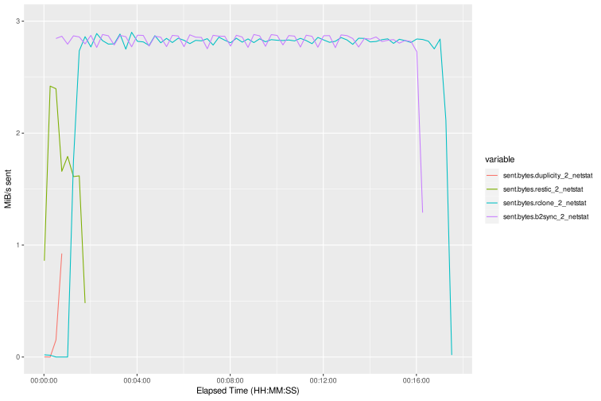
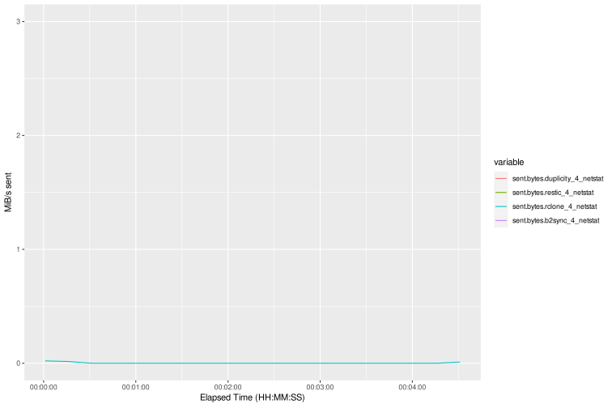

<!---
To make a PDF copy with pandoc:
pandoc graphsheet.md -o graphsheet.pdf --pdf-engine=xelatex
-->

# Backup Test Graphs
Applications tested:

* duplicity (red)
* restic (green)
* rclone (teal)
* b2-sync utility (purple)

Measurements:

* Data sent or received
* CPU usage (both user and system processes)
* Total mapped memory

All measurements were polled once per second, but the graphs are smoothed non-scientifically by averaging all the one-second measurements into larger chunks:

* The graphs for tests 0-1 use a sample rate of 5 minutes.
* The graphs for test 2 use 2 minutes (for the data sent graph) and 30 seconds (for the CPU and memory graphs).
* The graphs for tests 3-4 use 15 seconds (for the data sent graph) and 10 seconds (for the CPU and memory graphs).
* The graphs for test 5 use 2 minutes (for the data received graph) and 1 minute (for the CPU and memory graphs).

\pagebreak

## Test 0. Full backup

| Data sent (MiB/s) |
| - |
| {width="85%"} |

\pagebreak

| CPU usage (%) |
| - |
| {width="85%"} |

| Memory usage (GiB) |
| - |
| {width="85%"} |

\pagebreak

## Test 1. Incremental backup after adding files

| Data sent (MiB/s) |
| - |
| {width="85%"} |

\pagebreak

| CPU usage (%) |
| - |
| {width="85%"} |

| Memory usage (GiB) |
| - |
| {width="85%"} |

\pagebreak

## Test 2. Incremental backup after modifying one attribute in a batch of large TIFF files

| Data sent (MiB/s) |
| - |
| {width="85%"} |

\pagebreak

| CPU usage (%) |
| - |
| {width="85%"} |

| Memory usage (GiB) |
| - |
| {width="85%"} |

\pagebreak

## Test 3. Incremental backup after touching the modify date of a single large mp4 video

| Data sent (MiB/s) |
| - |
| {width="85%"} |

\pagebreak

| CPU usage (%) |
| - |
| {width="85%"} |

| Memory usage (GiB) |
| - |
| {width="85%"} |

\pagebreak

## Test 4. Incremental backup after removing files

| Data sent (MiB/s) |
| - |
| {width="85%"} |

\pagebreak

| CPU usage (%) |
| - |
| {width="85%"} |

| Memory usage (GiB) |
| - |
| {width="85%"} |

\pagebreak

## Test 5. Restore

| Data received (MiB/s) |
| - |
| {width="85%"} |

\pagebreak

| CPU usage (%) |
| - |
| {width="85%"} |

| Memory usage (GiB) |
| - |
| {width="85%"} |
